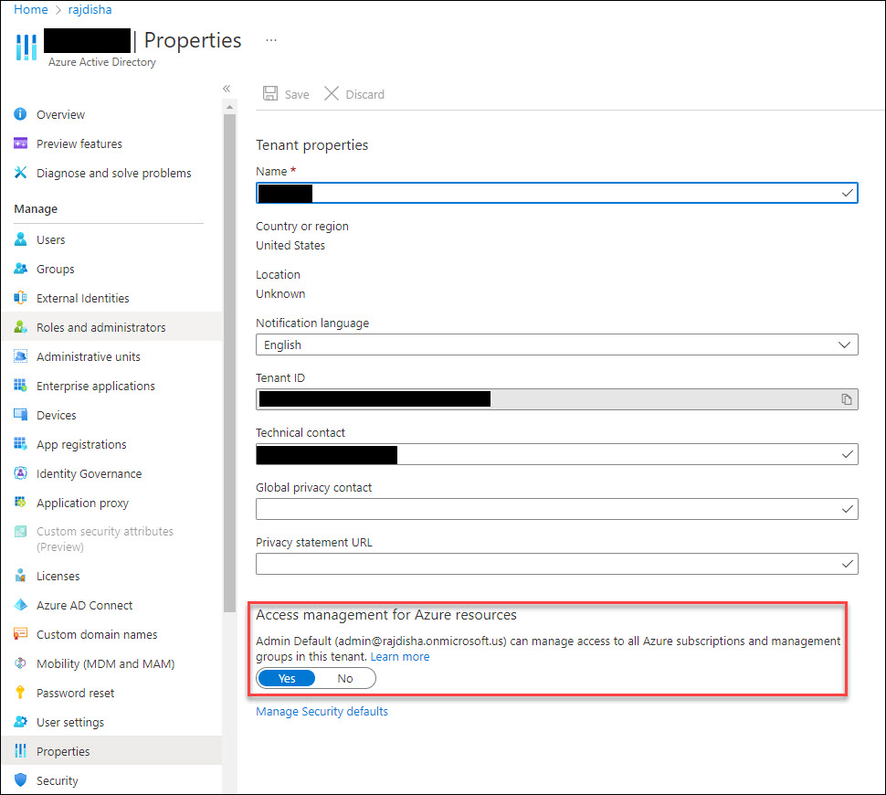
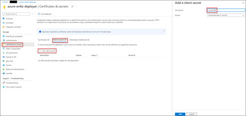

## Deployment Steps
### 1. Install Azure Active Directory (AAD) Prerequisites
Prerequisite Azure Active Directory items including Groups, Service Principal and Role Assignments are required to perform subsequent deployment steps.  This step is intended to be executed one time on first deployment.  It is packaged as a single PowerShell script and intended to be executed interactively from a PowerShell instance with access to the management plane of target Azure environment.  The script, **deploy-aadprereqs.ps1**, does the following:
* Creates Azure AD Group **azure-platform-owners**
* Creates Azure AD Group **azure-platform-readers**
* Assigns **azure-platform-owners** the Owner role at scope **/providers/Microsoft.Management/managementGroups/root_management_group_id**
* Assigns **azure-platform-readers** the Reader role at scope **/providers/Microsoft.Management/managementGroups/root_management_group_id**
* Creates AzureAD App **azure-entlz-deployer**
* Creates AzureAD Service Principal for App **azure-entlz-deployer**
* Adds AzureAD App Service Principal **azure-entlz-deployer** to group **azure-platform-owners**
* Adds Currently Logged in Deployment User to group **azure-platform-readers**

The user running the script must be elevated to **User Rights Administrator** temporarily in Azure Active Directory (Properties tab, see below).  After the script runs successfully the account should be removed from this role.



Generate a client Secret for the **azure-entlz-deployer** account in the App Registrations blade.  



**Make a note of the Client Secret value, Application ID and Tenant ID.**


### 2. Create GitHub Repository Secrets
Create new GitHub Repository Secrets for the target Azure Tenant workflow with the following variables:
* tenantid - Tenant ID from Step 1
* appid - Application ID from Step 1
* appsecret - Secret value from Step 1 (Set as Secured Variable!!)
* environment - Cloud Environment (ex. azureusgovernment)
* location - Azure Region (ex. usgovvirginia)
* connsubid - Connectivity Subscription ID
* entlzmg - Enterprise Landing Zone Root MG Name
* mgmtsubid - Management Subscription ID

* AZURE_CREDENTIALS
{
    "clientId": "xxxxx-xxxx-xxxx-xxx-xxxxxx",
    "clientSecret": "xxxxx-xxxx-xxxx-xxx-xxxxxx",
    "subscriptionId": "xxxxx-xxxx-xxxx-xxx-xxxxxx",
    "tenantId": "xxxxx-xxxx-xxxx-xxx-xxxxxx"
}


|  Secret Name        |  Value Format                                          |
|:--------------------|:-------------------------------------------------------|
| AZURE_ENVIRONMENT   | AzureUSGovernment                                      |
| AZURE_LOCATION      | USGovVirginia                                          |
| AZURE_CREDENTIALS  | { <br>   "clientId": "xxxxx-xxxx-xxxx-xxx-xxxxxx", <br>  "clientSecret": "xxxxx-xxxx-xxxx-xxx-xxxxxx", <br>       "subscriptionId": "xxxxx-xxxx-xxxx-xxx-xxxxxx", <br>     "tenantId": "xxxxx-xxxx-xxxx-xxx-xxxxxx" <br>         } |


| AZURE_CREDENTIALS  | {
|                    |    "clientId": "xxxxx-xxxx-xxxx-xxx-xxxxxx",
|                    |    "clientSecret": "xxxxx-xxxx-xxxx-xxx-xxxxxx",
|                    |    "subscriptionId": "xxxxx-xxxx-xxxx-xxx-xxxxxx",
|                    |    "tenantId": "xxxxx-xxxx-xxxx-xxx-xxxxxx"
|                    |}  |


Accept all other default values.


The variable group can be referenced in build and release pipelines.  The YAML is shown below:
```
variables:
- group: <Variable Group>
```

### 3. Run Build and Release Pipelines
The pipelines should be executed in the following order:
1. Management Groups
2. Management Services
3. VDSS
4. VDMS-Core
5. VDMS-Collab
6. Policies
7. Roles
8. Workbooks
9. Mission Workloads
    a. Generic Workload 
    b. Workspaces (VDI)
    c. Workshops (DevSecOps-DSOP Software Factory)
